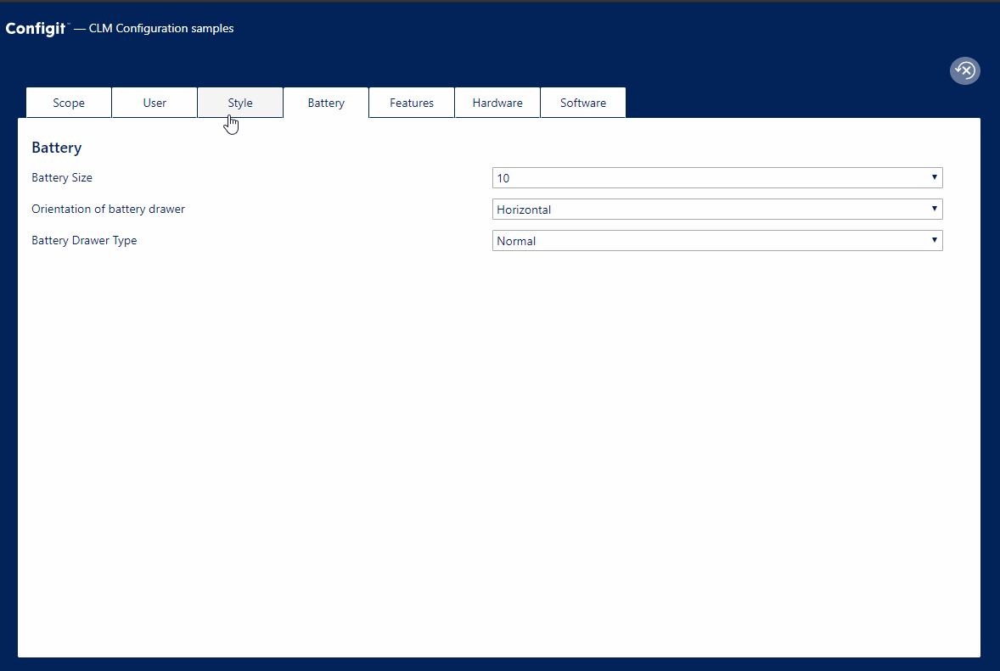
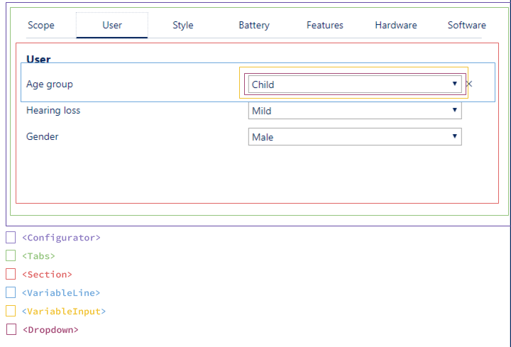

# Configurator sample

This sample shows how to create a small application that allows users to configure a product in a package on Ace Platform.

The application we are building looks like this:



This document describes how to build this basic configurator. It covers the following topics:

- [/configure endpoint review](#configure-endpoint-review)
- [Getting started](#getting-started)
- [UI from response](#ui-from-response)
- [Making assignments](#making-assignments)
  - [\<Dropdown>](#dropdown)
  - [\<TextInput>](#textinput)
  - [\<DateInput>](#dateinput)
  - [\<MultivaluedInput>](#multivaluedinput)
- [Conflict resolution](#conflict-resolution)
- [Dealing with issues](#dealing-with-issues)

## `/configure` endpoint review

We start with a quick review of the `/configure` endpoint. The endpoint is stateless which means that the client application is responsible for maintaining the current state of what the user has selected, and must provide that state in each request.

The `/configure` endpoint is designed for building interactive configurators. This means that:

- The endpoint responds with a structure of `sections`, `variables` and `values`. This structure depends on the product we're configuring and a client application can use this structure to organize the the variables/values for the user.
- The names of the `sections`, `variables` and `values` are translations and you can request a translation in a different language (if provided in the package)
- The value states in the response are simple and designed for a UI. There are two fields on each value that indicates the state:
  - `assigned` can be `byUser`, `byRule`, `byDefault`, `byPhase` or `undefined` and indicates why it is assigned. It if `undefined` it the value is not assigned.
  - `incompatible` is true if value can't be assigned without removing other user assignments.

The endpoint response looks like this:

```javascript
 "sections": [{
  "id": "General",
  "name": "General",
  "sections": [],
  "variables": [
    {
      "id": "TSHIRT_COLOR",
      "name": "Color",
      "valueType": "String",
      "distinctValueCount": 5,
      "allowMultipleAssignments": false,
      "values": [
        {
            "name": "Blue",
            "value": "BLUE",
            "properties": [],
            "assigned": "byUser",
            "incompatible": false
        },
       /* more values omitted for brevity */
      ],
    },
    /* more variables omitted for brevity */
```

_Refer to the Ace Platform documentation for more details._

## Getting started

We'll start by looking at the `<Configurator>` component defined in `src/pages/configurator/index.js`. The first thing we need to do is to call the `/configure` endpoint with the id of the product we want to configure.

The `<Configurator>` component defines a function called `configure` which we use to call the `/configure` endpoint.

```javascript
import configureAPI from '../../api/configure';

configure = async assignments => {
  const { productId } = this.props.match.params;
  const packagePath = process.env.REACT_APP_PACKAGE_PATH;

  try {
    const result = await configureAPI({
      packagePath,
      date: new Date(),
      line: {
        productId,
        variableAssignments: assignments.map(a => ({
          variableId: a.variable.id,
          value: a.value.value,
          exclude: a.value.exclude
        })
      }
    });

    this.setState({
      sections: result.sections,
      removedAssignments: result.removedAssignments
    });
  } catch (e) {
    // error handling left out for brevity
  }
};
```

The `configure` function calls the imported `api/configure` function which handles the HTTP call. The `/configure` endpoint gets called with:

- The id (`productId`) of the product to configure which we get by looking in the URL.
- The path (`packagePath`) of the package that contains the product which we get from the variable defined in the `.env` file.
- Any assignments (`assignments`) passed into the function as arguments, see section about [making assignments](#making-assignments).

After we get a response from the endpoint, we update the component state with `sections` and `removedAssignments`. `sections` contains a structuring of variables we can use when we [render the UI](#UI-from-response). `removedAssignments` contains the [assignments](#making-assignments) from our request that were removed to keep the configuration valid. We can use them to display messages to users that they tried to assign invalid values.

We call this function when the component is mounted.

```javascript
componentDidMount() {
  this.configure();
}
```

This means that we are ready to render the UI when the component's state contains sections.

## UI from response

We want to use the sections from the endpoint response to organize the UI. We do this by passing the sections down to child components. The UI is composed of the following components:



We start by rendering the tabs like this:

```jsx
<Tabs
  tabs={sections.map((section) => section.name)}
  onTabChange={this.handleActiveTabChange}
  activeTabIndex={activeTabIndex}
>
  <Section section={activeSection} />
</Tabs>
```

The `handleActiveTabChange` function is called by the `<Tab>` component when the active tab is changed. This function updates the `activeSection` that is passed to the `<Section>` component.

### `<Section>`

A `section` in the response has a list of variables and a list of potential (sub)sections. We use the `<Section>` component to render a `section`. We do this by rendering `<VariableLine>`s for each variable and `<Sections>`s for each subsection, like so:

```jsx
import { showVariable } from '../utils/variable-utils.js';

// Some variables may be hidden and we don't want to render those.
const visibleVariables = section.variables.filter(showVariable);

if (visibleVariables.length === 0 && section.sections.length === 0) {
  return null;
}

return (
  <div>
    {/* The name of the first level of sections are already dislayed in the tabs */}
    {level > 0 && (
      <header className={`section-header section-header-level${level}`}>
        {section.name}
      </header>
    )}
    {visibleVariables.map((variable) => (
      <VariableLine
        key={variable.id}
        variable={variable}
        onAssign={onAssign}
        onUnassign={onUnassign}
        removedAssignments={removedAssignments}
      />
    ))}
    {(section.sections || []).map((subSection) => (
      <Section
        key={`${section.id}-${subSection.id}`}
        section={subSection}
        onAssign={onAssign}
        onUnassign={onUnassign}
        removedAssignments={removedAssignments}
        level={level + 1}
      />
    ))}
  </div>
);
```

### `<VariableLine>`

The `<VariableLine>` component can render a line in the configurator and it takes a `variable` from the configuration response as an input.

A line in the configurator includes:

- The name of the variable.
- An asterisk which indicates if the variable is required.
- A list of potential issues related to the variable.
- An input control (for example a dropdown) for assigning values to the variable.
- A button to remove any assignments from the variable.

This is implemented like this:

```jsx
<div className={className}>
  <div className="variable-line-text">
    {variable.name} <RequiredMark variable={variable} />
    <Issues variable={variable} />
  </div>
  <div className="variable-line-input">
    <VariableInput
      removedAssignments={removedAssignments}
      variable={variable}
      onAssign={onAssign}
      onUnassign={onUnassign}
    />
  </div>
  <div className="variable-line-actions">
    {hasUserAssignedValue(variable) && (
      <UnassignButton variable={variable} onUnassign={onUnassign} />
    )}
  </div>
</div>
```

### `<VariableInput>`

The `<VariableInput>` renders an input control that lets the user assign values to a variable. It does this by rendering either a `<Dropdown>`, `<TextInput>` or `<MultivaluedInput>` component, like so:

```jsx
if (variable.allowMultipleAssignments) {
  return (
    <MultivaluedInput
      variable={variable}
      onAssign={onAssign}
      onUnassign={onUnassign}
    />
  );
}
if (variable.valueType === 'Number' && variable.distinctValueCount > 25) {
  return (
    <TextInput
      variable={variable}
      onAssign={onAssign}
      onUnassign={onUnassign}
      removedAssignments={removedAssignments}
    />
  );
}
if (variable.valueType === 'String' && !variable.distinctValueCount) {
  return (
    <TextInput
      variable={variable}
      onAssign={onAssign}
      onUnassign={onUnassign}
      removedAssignments={removedAssignments}
    />
  );
}
return (
  <Dropdown variable={variable} onAssign={onAssign} onUnassign={onUnassign} />
);
```

We have chosen to use the type of the variable and the number of distinct values to decide which component to render.

- For variables that allow multiple assignments, we render a `<MultivaluedInput>` component.
- For number variables with more than 25 distinct values, we render a `<TextInput>` allowing the user to type a value.
- For string variables with an unspecified number of distinct values, we also render a `<TextInput>` because this means that the string value accepts any number of values.
- For everything else, we render a `<Dropdown>`.

These are just the choices of this basic configurator; you could choose a different layout scheme, e.g., show radio buttons, images, etc. based on other criteria such as screen size, device type etc.

We now have a basic understanding of how to call the `/configure` endpoint and render a UI based on the structure in the response. Next, we will look at the input controls and how to make assignments.

## Making assignments

Before we start looking at the components that let users select values for the variables, we need to understand how to manage the state between the server and our client application.

### Managing state

The `/configure` endpoint is stateless. Thus, it doesn't store any state between requests. Each time we call the server, the server has forgotten all about any previous calls. Therefore it is up to the client to store and maintain a list of choices the user has made so far.

We store this list of choices (or assignments) as an array in our root component and define two functions for handling assignments and un-assignments.

```javascript
import { assign, unassign } from './utils/assignment-utils';

handleOnAssign = (variable, value) => {
  const currentAssignment = toAssignment(variable, value);
  const newAssignments = assign(this.assignments, currentAssignment);
  this.assignments = newAssignments;
  this.configure(newAssignments);
};

handleOnUnassign = (variable, value) => {
  const currentAssignment = toAssignment(variable, value);
  const newAssignments = unassign(this.assignments, currentAssignment);
  this.assignments = newAssignments;
  this.configure(newAssignments);
};
```

These two functions manipulate the `this.assignments` array using the helper function defined in `./utils/assignment-utils.js` and then call the server with the updated assignments.

We pass these two functions down to the components that that let users select values.

> Now is a good time to look at the two utility files called
>
> - `configurator/utils/assignment-utils.js` - defines helper functions for manipulating an array of assignments.
> - `configurator/utils/variable-utils.js` - defines helper functions for inspecting the state of variable/values.
>
> These two utility files are useful for almost any configurator application you may want to write. Feel free to copy those to your project and update them as necessary.

### `<Dropdown>`

The `<Dropdown>` component renders a dropdown of with possible values a user can choose for a variable. In our basic configurator we'll use the a [`<select>`](https://developer.mozilla.org/en-US/docs/Web/HTML/Element/select) element as our dropdown; you may want to provide a better experience and use a component like [react-select](https://react-select.com/home) or similar, regardless the concepts are the same.

We want to:

- Render an option for each value.
- Render an empty option for unassigning when possible.
- Select the currently assigned value.

```jsx
class Dropdown extends React.Component {
  handleOnChange = e => {
    const { variable, onAssign, onUnassign } = this.props;
    const { value } = e.target;

    value === NO_VALUE_VALUE
      ? onUnassign(variable.id)
      : onAssign(
        variable,
        variable.values.find(v => v.value.toString() === value
      );
  };

  render() {
    const { variable } = this.props;
    const assignedValue = getAssignedValue(variable) || NO_VALUE;

    return (
      <select
        className="dropdown"
        value={assignedValue.value}
        onChange={this.handleOnChange}
      >
        {!hasSystemAssignedValue_(variable) && (
          <option key={NO_VALUE_VALUE} value={NO_VALUE_VALUE} />
        )}
        {variable.values.map((value, i) => (
          <Option key={`${value.value}-${i}`} value={value} />
        ))}
      </select>
    );
  }
}
```

In the `<Option>` component we wrap the "native" [`<option>`](https://developer.mozilla.org/en-US/docs/Web/HTML/Element/option) and add a css class when the value is `incompatible`. This allows us to color incompatible options to indicate the value is incompatible with the current configuration. In the section about [conflict resolution](#conflict-resolution) we'll look at how to handle assignments of `incompatible` values.

```jsx
function Option({ value }) {
  const { name } = value;

  const className = classnames({
    'dropdown-incompatible': value.incompatible,
  });

  return (
    <option className={className} value={value.value}>
      {name}
    </option>
  );
}
```

### `<TextInput>`

A <TextInput> is a text field that allows users to type in a value for a variable. Unlike the `<Dropdown>`, this means that the user can enter invalid values and we need to deal with that.

> **Invalid vs Incompatible**
>
> Invalid is not the same as Incompatible.
>
> - **Incompatible** means that you can get the value if you remove some other value(s)
> - **Invalid** means that you can never assign that value to the variable. For example, if you try to assign the value "red" to a numeric variable.

In the `<TextInput>` component we want to:

- Render an input field and make assignments when the value changes.
- Display the currently assigned value in the text field.
- Render a message if the user tried to assign an invalid value.

When we try to assign invalid values, the `/configure` endpoint responds with a list of removed assignments. These are assignments that have been removed from what was requested. We can check if the variable behind the text input is in the list of removed assignments and display a message and add the `input-invalid` CSS class.

```jsx
class TextInput extends React.Component {
  handleOnChange = (value) => {
    const { variable, onAssign, onUnassign } = this.props;

    value === '' ? onUnassign(variable) : onAssign(variable, { value });
  };

  render() {
    const { variable, removedAssignments } = this.props;
    const assignedValue = (getAssignedValue(variable) || { value: '' }).value;

    const removedAssignment = findRemoved(variable, removedAssignments);
    const message = removedAssignment
      ? getInvalidMessage(variable, removedAssignment)
      : null;
    const className = classnames('input', {
      'input-invalid': message,
    });
    const displayValue = removedAssignment
      ? removedAssignment.value.value
      : assignedValue;

    return (
      <div className="text-input">
        <Input
          className={className}
          type={variable.valueType === 'Number' ? 'number' : undefined}
          value={displayValue}
          onChange={this.handleOnChange}
        />
        <div className="text-input-help">{message}</div>
      </div>
    );
  }
}
```

### `<DateInput>`

The implementation of the `<DateInput>` component is very similar to `<TextInput>`. In this example we use the native [`<input type="date">`](https://developer.mozilla.org/en-US/docs/Web/HTML/Element/input/date), as we want to focus on using the `/configure` endpoint rather than focusing on how to use a date picker. The ideas in the implementation can be reused for other 3rd-party date pickers.

As with `<TextInput>` we want to:

- Render a date input field and make assignments when the value changes.
- Display the currently assigned value.
- Render a message if the user tried to assign an invalid value.

```jsx
class DateInput extends React.Component {
  handleOnChange = (value) => {
    const { variable, onAssign, onUnassign } = this.props;

    value ? onAssign(variable, { value }) : onUnassign(variable);
  };

  render() {
    const { variable, removedAssignments } = this.props;
    const assignedValue = (getAssignedValue(variable) || { value: '' }).value;

    const removedAssignment = findRemoved(variable, removedAssignments);
    const message = removedAssignment
      ? getInvalidMessage(variable, removedAssignment)
      : null;
    const className = classnames('input', {
      'input-invalid': message,
    });

    let displayValue = removedAssignment
      ? removedAssignment.value.value
      : assignedValue;

    return (
      <div className="date-input">
        <DatePicker
          className={className}
          type="date"
          value={displayValue}
          onChange={this.handleOnChange}
        />
        <div className="date-input-help">{message}</div>
      </div>
    );
  }
}
```

The details of interacting with the native date input control are encapsulated in the `<DatePicker>` component.

### `<MultivaluedInput>`

The `<MultivaluedInput>` component renders variables that allow multiple assignments, known in the Configuration API as _multi-assign variables_. Before diving in to the component, let's review how multi-assign variables work using the options of a bicycle as an example.

Say that **options** is a multi-assign variable with two values **bottle** and **carrier**. We can display the variable in a UI like this:

```
Options
  Bottle    🔘 Yes   🔘 No
  Carrier   🔘 Yes   🔘 No
```

For each value:

- The user can select 'Yes' (I want this option) or 'No' (I don't want this option).
- The system can select 'Yes' or 'No' due to defaults or rules.
- The system can mark 'Yes' or 'No' as incompatible due to rules.

When we make assignments and render the current configuration, we need more than just variable and value: we also need to know if the value is included in the configuration ('Yes') or excluded ('No'). The 'Yes' case is handled the same as a normal value assignment. For the 'No' case, we need to examine the `excluded` state of the value; if it has an `assigned` property, then the value should be excluded ('No').

Below is a sample response for a multi-assign variable. As we can see, the variable has a property `allowMultipleAssignments`, and the variable's values have an extra `excluded` state.

```json
{
  "id": "BIKE_OPTIONS",
  "name": "BIKE_OPTIONS",
  "valueType": "String",
  "allowMultipleAssignments": true,
  "values": [
    {
      "value": "BOTTLE",
      "excluded": { "assigned": "byUser", "incompatible": false },
      "incompatible": false
    },
    {
      "value": "CARRIER",
      "excluded": { "incompatible": true },
      "assigned": "byUser",
      "incompatible": false
    }
  ]
}
```

Here we can see:

- The **BOTTLE** value's `excluded` state is assigned by the user. The user has selected that he doesn't want a bottle.
- The **CARRIER** value is assigned by the user. The user has selected that he wants a carrier. Further, the carrier's `excluded` state is incompatible; so in the future, if the user selects 'No' for carrier, one or more other user assignments will be removed by the configurator.

Likewise, when we make assignments, we need to specify if we are assigning to the include or exclude state. To assign 'No' to bottle and 'Yes' to carrier we need these assignments:

```javascript
[
  { variableId: 'OPTIONS', value: 'BOTTLE', exclude: true },
  { variableId: 'OPTIONS', value: 'CARRIER' },
];
```

The `<MultivalueInput>` renders a UI like the one above with two options for each value (so the user can 'include' or 'exclude' the value).

```jsx
class MultivaluedInput extends React.Component {
  render() {
    const { variable, onAssign, onUnassign, text } = this.props;

    const values = !variable.distinctValueCount
      ? [...variable.values.slice(1)]
      : variable.values;

    return (
      <div className="multivalued">
        {values.map((value) => (
          <div className="multivalued-options" key={value.value}>
            <div className="multivalued-options-title">{variable.name}</div>

            <MultivaluedOption
              variable={variable}
              value={value}
              onAssign={onAssign}
              onUnassign={onUnassign}
              excluded={false}
              key="yes"
              text={text}
            />

            <MultivaluedOption
              variable={variable}
              value={value}
              onAssign={onAssign}
              onUnassign={onUnassign}
              excluded={true}
              key="no"
              text={text}
            />
          </div>
        ))}
      </div>
    );
  }
}
```

In the `<MultivaluedOption>` we:

- Renders a single radio button.
- Call `onAssign` or `onUnassign` with the right exclude option when the radio button is clicked.
- We add a `multivalued-option-incompatible` CSS class if the value is incompatible

```jsx
class MultivaluedOption extends React.Component {
  assigned(value, excluded) {
    return value && (excluded ? value.excluded.assigned : value.assigned);
  }

  incompatible(value, excluded) {
    return (
      value && (excluded ? value.excluded.incompatible : value.incompatible)
    );
  }

  handleOnChange = () => {
    const { onAssign, onUnassign, variable, value, excluded } = this.props;
    if (this.assigned(value, exclude) === 'byUser') {
      onUnassign(variable, { value: value.value, exclude });
    } else {
      onAssign(variable, { value: value.value, exclude });
    }
  };

  render() {
    const { value, excluded } = this.props;
    const className = classnames('multivalued-option', {
      'multivalued-option-incompatible': this.incompatible(value, excluded),
    });
    const checked = !!this.assigned(value, excluded);

    return (
      <label className={className}>
        <input
          type="radio"
          name={value.value}
          checked={checked}
          id={value.value + excluded}
          onClick={this.handleOnChange}
          value={value.value}
        />
        {excluded ? 'No' : 'Yes'}
      </label>
    );
  }
}
```

## Conflict resolution

The input components (`<Dropdown/>`, `<MultivaluedInput>` etc.) render **incompatible** values, for example the `<Dropdown>` component renders a gray background for incompatible values. Whether or not you want to render incompatible values is a choice you can make when building a configurator. For simple, wizard-style configurators it may be a better user experience to hide incompatible values.

When we render incompatible values, we also need to handle what happens when a user selects such a value. We use the term _conflict resolution,_ to cover how the configurator handles incompatible choices. When assigning incompatible values, the `/configure` endpoint will respond with a list of assignments that have been removed to keep the configuration valid. We want to display this information to the user and let her choose if she wants to keep the conflicting assignment and remove the previous assignments or to ignore the conflicting assignment and keep the previous assignments.

We do that in a dialog like this:


> **NOTE** this is only one way of implementing conflict resolution in the configurator. Another typical pattern is to just perform the assignment and allow the user to undo the operation. That is, just make the assignment and inform the user of what was removed, and allow her to undo the last assignment.

### `<ConflictDialog>`

When showing the conflict dialog, we want to:

- Display the assignment that caused the conflict.
- Display the consequence of making that assignment.
- Allow the user to accept or reject the assignment.

```jsx
function ConflictDialog({ conflict, onAccept, onReject }) {
  const currentAssignment = (conflict || {}).currentAssignment;
  const removedAssignments = (conflict || {}).removedAssignments;

  return (
    <Dialog onDismiss={onReject} isOpen={!!conflict}>
      <div className="conflict">
        <div className="conflict-content">
          <h1>Assign and remove?</h1>
          {currentAssignment && (
            <>
              <div>Assigning</div>
              <ul>
                <li>
                  <FormatAssignment
                    assignment={currentAssignment}
                    separator="To"
                  />
                </li>
              </ul>
              <div>Removes</div>
              <ul>
                {removedAssignments.map((ra) => (
                  <li key={ra.variable.id}>
                    <FormatAssignment assignment={ra} separator="From" />
                  </li>
                ))}
              </ul>
            </>
          )}
        </div>
        <div className="conflict-footer">
          <Button onClick={onAccept}>Assign and remove</Button>
          &nbsp;&nbsp;
          <Button variant="link" onClick={onReject}>
            Cancel
          </Button>
        </div>
      </div>
    </Dialog>
  );
}
```

The `<ConflictDialog>` expects a `conflict` object that has a `currentAssignment` and a list of `removedAssingments` and two functions or handling acceptance and rejection.

The creation of the `conflict` object and the implementation of the `onAccept` and `onReject` is done in the `<Configurator>` component. After we have received a response from the server (see the [Getting started](#getting-started) section for details), we want to check for conflicts.

```javascript
// update the state when new sections with the
// result from the `/configure` endpoint
const conflict = getConflict(
  currentAssignment,
  result.removedAssignments.variableAssignments
);
if (conflict) {
  this.setState({ conflict, nextResult: result, error: null });
} else {
  this.setState({
    sections: result.sections,
    removedAssignments: result.removedAssignments,
    error: null,
  });
}
```

We use the `getConflict` function from the `utils/variable-utils.js` to check for conflicts. If there is a conflict, we update the component state with the conflict object. We also add the result as `nextResult` to the component state; this allows us to apply this result if the user accepts the conflicting assignment.

#### Accepting the conflict

If the user accepts the conflict, we want to:

- Prune our local assignments array so it matches the current list of assignments. We do that by removing the assignments that got removed by the server.
- Use the stored `nextResult` to re-render the configurator.

```javascript
handleAcceptConflict = () => {
  this.assignments = removeAssignments(
    this.assignments,
    this.state.conflict.removedAssignments
  );

  this.setState({
    conflict: undefined,
    sections: this.state.nextResult.sections,
    nextResult: null,
  });
};
```

#### Rejecting the conflict

If the user rejects the conflict, we want to:

- Remove the `conflict` object from our state.
- Remove the conflicting assignment from the local assignments array.

```javascript
handleRejectConflict = () => {
  const { currentAssignment } = this.state.conflict;
  this.assignments = unassign(this.assignments, currentAssignment);

  this.setState({ conflict: null });
};
```

# Dealing with issues

In some cases, the Configuration API chooses to not auto-resolve all conflicts, but instead allows the configuration to be invalid. This can occur for product models extracted from SAP or product models with arithmetic rules. When the configuration is invalid, the response contains "issues".

In a configurator application, we display these issues to the user. We do this in the `<InvalidMark>` and `<IssuesDialog>` components. The `<InvalidMark>` gets rendered if there are any issues.

```jsx
class InvalidMark extends React.Component {
  state = {
    showDialog: false,
  };

  render() {
    const { issues } = this.props;

    const { showDialog } = this.state;
    if (!issues) {
      return null;
    }

    return (
      <>
        <button
          className="invalid-mark"
          onClick={() => this.setState({ showDialog: !showDialog })}
        >
          Invalid ({issues.length === 1 ? '1 issue' : `${issues.length} issues`})
        </button>
        <IssuesDialog
          issues={issues}
          isOpen={showDialog}
          onDismiss={() => this.setState({ showDialog: false })}
        />
      </>
    );
  }
}
```

When the user clicks the invalid mark, we render the `<IssuesDialog>`.

```jsx
function IssuesDialog({ issues, isOpen, onDismiss }) {
  return (
    <Dialog onDismiss={onDismiss} isOpen={isOpen}>
      <div className="issues-dialog">
        <div className="issues-content">
          <h1>Invalid configuration</h1>
          <div className="issues-lead">
            {issues.length === 1 ? '1 Issue' : `${issues.length} Issues`} found
          </div>
          <ul className="issues-list">
            {issues.map((issue, i) => (
              <li key={i}>
                <FormatMessage message={issue.message} />
              </li>
            ))}
          </ul>
        </div>
        <div className="issues-footer">
          <Button onClick={onDismiss}>OK</Button>
        </div>
      </div>
    </Dialog>
  );
}
```
