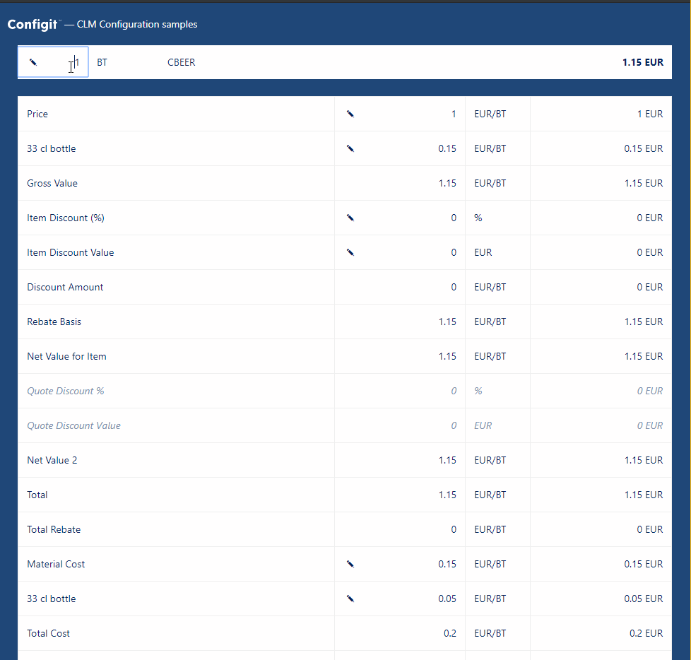

# Price sample

This sample shows how to create an application that lets users view and edit a price sheet for a product in a package on Ace Platform.

The application we are building looks like this:



This document describes how to build this basic price sheet. It covers the following topics:

- [/price endpoint review](#price-endpoint-review)
- [Getting started](#getting-started)
  - [Global arguments](#global-arguments)
- [UI from the response](#ui-from-the-response)
  - [\<PriceSheet>](#pricesheet)
  - [\<PriceLine>](#priceline)
- [Making assignments](#making-assignments)
  - [\<PriceLineInput>](#pricelineinput)
- [Quantity](#quantity)
- [ Configuration dependent prices](#configuration-dependent-prices)

## `/price` endpoint review

We start with a quick review of the `/price` endpoint. The endpoint is stateless, which means that the client application is responsible for keeping track of which price lines the user has edited, and must provide that state in each request.

The endpoint response looks like this:

```javascript
priceSheet: {
  id: 'CBEER',
  totals: {
    tax: { value: 0.0, currency: 'EUR' },
    net: { value: 1.15, currency: 'EUR' },
    total: { value: 1.15, currency: 'EUR' }
  },
  priceLines: [
  {
    id: '011.00/ef3dded2-b4ba-b20e-b7e0-5bf5eee9a4b2',
    stepId: '011.00',
    name: 'Price',
    rate: {
      isAssignable: true,
      isAssigned: false,
      batchSize: { value: 1.0, unit: 'BT' },
      signConstraint: 'None',
      value: 1.0,
      unit: 'EUR'
    },
    result: { value: 1.0, unit: 'EUR' },
    status: {
      isInformational: false,
      isDisabled: false,
      isInvalid: false,
    }
  }
  /* more pricelines omitted for brevity */
 ]
}
```

_Refer to the Ace Platform documentation for more details._

## Getting started

We'll start by looking at the `<Pricing>` component defined in `src/pages/pricing/index.js`. The first thing we need to do is to call the `/price` endpoint.

The `<Pricing>` component defines a function named `price` which we use to call the `/price` endpoint.

```javascript
import priceAPI from '../../api/price';

price = async (quantity, assignments = {}) => {
  const { productId } = this.props.match.params;
  if (!productId) {
    return;
  }
  const packagePath = process.env.REACT_APP_PACKAGE_PATH;

  try {
    const result = await priceAPI({
      packagePath,
      date: new Date(),
      language: 'EN',
      globalArguments,
      line: {
        quantity,
        productId,
        priceLineAssignments: Object.keys(assignments).map((k) => ({
          stepId: k,
          rateValue: assignments[k],
        })),
      },
    });
    this.setState({
      priceSheet: result.priceSheet,
    });
  } catch (e) {
    // error handling left out for brevity
  }
};
```

The `price` function calls the imported `api/price` function, which handles the HTTP call. The `/price` endpoint gets called with:

- The id (`productId`) of the product to configure which we get by looking in the URL.
- The path (`packagePath`) of the package that contains the product which we get from the variable defined in the `.env` file.
- Global arguments (`globalArguments`) that contain any "external" data that is needed to calculate a price. See [Global arguments](#global-arguments).
- The quantity (`quantity`). To calculate a price we need to know the [quantity](#quantity).
- Any assignments (`assignments`) passed into the function as arguments. See [Making assignments](#making-assignments).

After we get a response from the endpoint, we update the component state with the `priceSheet`. The `priceSheet` contains a list of `priceLines` that we use when we [render the UI](#UI-from-response).

We call this function when the component is mounted:

```javascript
componentDidMount() {
  this.price(this.quantity);
}
```

We are ready to render the UI when the component's state contains the `priceSheet`.

### Global arguments

Often the price of a product depends on external factors such as:

- Where the product is sold
- Who the product is sold to
- Where the product is manfufactured

Providing these external factors is the job of arguments. Knowing which arguments are needed depends on how the prices were defined.

It is up to the application that calls the `/price` endpoint to provide the correct arguments. In a real application, arguments may contain data entities such as the customer and salesperson. However, in this sample application, we use hardcoded arguments that match the sample data provided with Ace Platform. These are located in `src/globalArguments.js` as a simple object:

```javascript
{
  SalesArea: {
    SalesOrganization: '0001',
    DistributionChannel: '01',
    SalesDivision: '01'
  }
}
```

**NOTE** When you use other packages, make sure to change the arguments to match what the price definition in that package requires.

## UI from the response

We want to render a row in a table for each `priceline` in a `priceSheet`. We do this by passing the `priceSheet` down to the `<PriceSheet>` component.

```jsx
<PriceSheet priceSheet={priceSheet} />
```

### `<PriceSheet>`

A `priceSheet` in the response has a list of `priceLines`. In the `<PriceSheet>` component we render a `<PriceLine>` component for each priceline:

```jsx
function PriceSheet({ priceSheet, onAssign }) {
  return (
    <table className="price-sheet-table">
      <colgroup>
        <col />
        <col width="20%" />
        <col width="10%" />
        <col width="200px" />
      </colgroup>
      <tbody>
        {priceSheet.priceLines.map((priceLine) => (
          <PriceLine
            priceLine={priceLine}
            key={priceLine.id}
            onAssign={onAssign}
          />
        ))}
      </tbody>
    </table>
  );
}
```

### `<PriceLine>`

The `<PriceLine>` component renders a row in the `<PriceSheet>` table, and takes a `priceLine` as input.

A row in the `<PriceSheet>` includes:

- The name of the price line
- The rate value (which can be editable)
- The rate unit
- The result value and unit
- A CSS class marking if the line is invalid, disabled, or informational

It is implemented like this:

```jsx
const className = classnames({
  informational: priceLine.status.isInformational,
  invalid: priceLine.status.isInvalid,
  disabled: priceLine.status.isDisabled,
});
return (
  <tr className={className}>
    <td>{priceLine.name}</td>
    <td className="align-right">
      {priceLine.rate.isAssignable && !priceLine.status.isDisabled ? (
        <PriceLineInput priceLine={priceLine} onAssign={onAssign} />
      ) : (
        priceLine.rate.value
      )}
    </td>
    <td>
      {priceLine.rate.unit}
      {priceLine.rate.batchSize ? '/' + priceLine.rate.batchSize.unit : ''}
    </td>
    <td className="align-right">
      {priceLine.result.value} {priceLine.result.unit}
    </td>
  </tr>
);
```

If the rate is assignable, we render a `<PriceLineInput>` which allows the user to change the rate value.

## Making assignments

Before we start looking at the component that let users change the rate of pricelines, we need to understand how to manage the state between the server and our client application.

### Managing state

The `/price` endpoint is stateless. Thus, it doesn't store any state between requests. Each time we call the server, the server has forgotten all about any previous calls. It is up to the client to store and maintain a list of changes the user has made so far.

We store this list of changes (assignments) as an object in our root component and define a function for adding and changing assignments:

```javascript
handleOnAssign = (stepId, rateValue) => {
  this.assignments[stepId] = rateValue;
  this.price(this.quantity, this.assignments);
};
```

The function takes the `stepId` and the new `rateValue` and manipulates the `this.assignments` before calling the server with the updated assignments.

We pass the functions down to the components that let users select values.

### `<PriceLineInput>`

The `<PriceLineInput>` renders an input control that lets the user change the rate of the price line.

Certain pricelines only allow negative rate values, e.g., discount pricelines, while others only allow positive rate values, e.g., surcharge pricelines. We want users to be able to enter a number and get it automatically converted based on this sign constraint.

We do this conversion in the `handleOnChange` function which:

- Converts positive numbers to negative numbers when needed.
- Converts negative numbers to positive numbers when needed.

```jsx
function PriceLineInput({ priceLine, onAssign }) {
  function handleOnChange(value) {
    const nValue = Number(value);
    if (priceLine.rate.signConstraint === 'Negative') {
      onAssign(priceLine.stepId, Math.sign(nValue) <= 0 ? nValue : nValue * -1);
    } else if (priceLine.rate.signConstraint === 'Positive') {
      onAssign(priceLine.stepId, Math.sign(nValue) >= 0 ? nValue : nValue * -1);
    } else {
      onAssign(priceLine.stepId, nValue);
    }
  }

  return (
    <Input
      showEditMarker
      className="price-line-input"
      value={priceLine.rate.value}
      onChange={handleOnChange}
    />
  );
}
```

## Quantity

Quantity is part of calculating the price of a product; the price definitions may have specific logic regarding quantity such as volume discounts.
Quantity consists of a value (amount) and a unit (e.g., pieces, boxes, bottles). Therefore we need to request the price sheet in a given quantity. In our sample application, we have a `<PriceHeader>` component that lets the user change the quantity.

It renders:

- An input field for changing the quantity value
- An input field for changing the quantity unit
- The name of the product
- The total price

```jsx
<div className="price-header">
  <div className="price-header-quantity-value">
    <Input
      showEditMarker
      value={quantity.value}
      onChange={(value) =>
        onQuantityChange({
          value: Number(value) || 1,
          unit: quantity.unit,
        })
      }
    />
  </div>
  <div className="price-header-quantity-unit">
    <Input
      value={quantity.unit}
      onChange={(unit) =>
        onQuantityChange({
          value: quantity.value,
          unit,
        })
      }
    />
  </div>
  <div className="price-header-product-id">{productId}</div>
  <div className="price-header-price">
    {totalPrice.value} {totalPrice.currency}
  </div>
</div>
```

Similarly to [assignments](#making-assignments), we create a function for updating the quantity in the `<Pricing>` component. This updates the quantity field and calls the `/price` endpoint to recalculate the price:

```javascript
handleQuantityChange = (quantity) => {
  this.quantity = quantity;
  this.price(quantity, this.assignments);
};
```

## Configuration dependent prices

For configurable products, the price often depends on which choices the user made to the configuration. Therefore `/price` endpoint allows you to pass in [variable assignments](CONFIGURATOR.md#making-assignments) when requesting a price sheet. When you provide variable assignments, the `/price` endpoint adds price contributions from the configuration to the price report.

To keep the sample application simple, it doesn't include this step. You can extend it by adding variable assignments to the `price` in the `<Pricing>` component:

```javascript
price = async (quantity, assignments = {}) => {
    /* code left out for brevity */
      const result = await priceAPI({
        /* code left out for brevity */
        line: {
           /* code left out for brevity */
          priceLineAssignments: Object.keys(assignments).map(k => ({
            stepId: k,
            rateValue: assignments[k]
          })),
         variableAssignments: /* get variables assignments from somewhere */
        }
      });
```

How to retrieve the variable assignments to pass in depends on your use case. Perhaps you want to read them from a database, or perhaps you want to keep them in memory.
