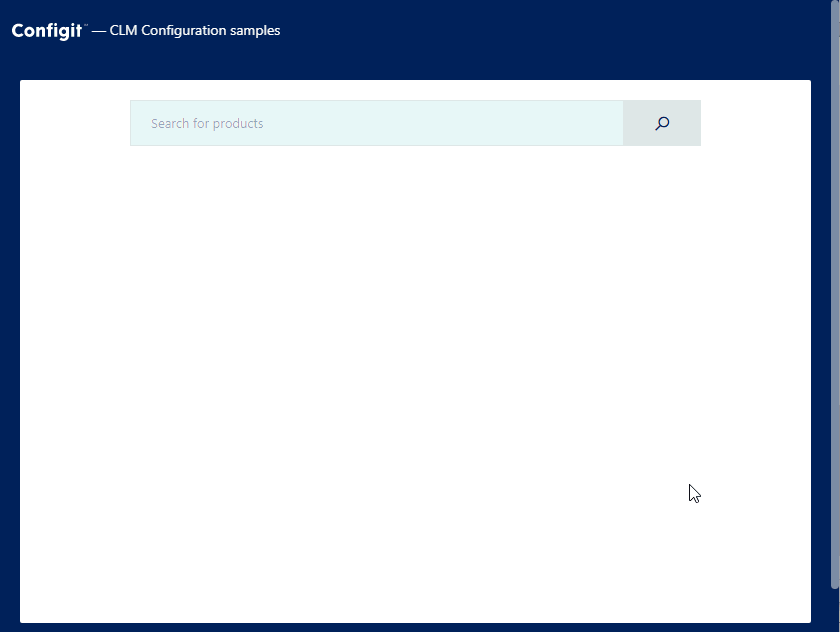

## Product search sample

This sample shows how to create a small application that allows users to search for products in a package on Ace Platform.

The application we are building looks like this:



The code for the product search example is located at `src/pages/product-search/index.js`.

The root component looks like this:

```jsx
import products from '../../api/products';

class ProductSearch extends React.Component {
  state = { isSearching: false, products: [] };

  handleSearch = async (searchTerm) => {
    this.setState({ isSearching: true });
    const result = await products({
      packagePath: process.env.REACT_APP_PACKAGE_PATH,
      searchTerm,
    });
    this.setState({ isSearching: false, products: result.products });
  };

  render() {
    const { isSearching, products } = this.state;

    return (
      <Example>
        <div className="product-search">
          <SearchInput isSearching={isSearching} onSearch={this.handleSearch} />
          {isSearching ? 'Searching...' : <ProductList products={products} />}
        </div>
      </Example>
    );
  }
}
```

To call the `/products` endpoint we'll use the function defined in the `./api/products.js` file.

The `handleSearch` function is called when a user clicks the search button. It calls the endpoint and updates the local state with the returned products. These products are passed to the `ProductList` component. The `ProductList` component renders a summary of each product.

```jsx
function ProductSummary({ product, showDetails, onToggleDetails }) {
  return (
    <div className="product-summary">
      <div>
        <div>{product.name}</div>
        <div>
          <em>{product.description}</em>
        </div>
      </div>
      <div>
        <div>
          <em>
            {product.isConfigurable ? (
              <a href={`/configurator/${product.id}`}>Configure</a>
            ) : (
              'Standard'
            )}
          </em>
        </div>
        <div>
          {product.properties.length ? (
            <button onClick={onToggleDetails}>
              {showDetails ? 'Hide details' : 'Show details'}
            </button>
          ) : null}
        </div>
      </div>
    </div>
  );
}
```

Each product has a name, a description, a flag indicating if it is configurable, and a list of properties. The properties are rendered by the `ProductDetails` component.

```jsx
const ProductDetails = ({ product }) => (
  <div className="product-details">
    {product.properties.map((property) => (
      <React.Fragment key={property.id}>
        <div>{property.id}</div>
        <div>{property.value}</div>
      </React.Fragment>
    ))}
  </div>
);
```

A product also has an `id` which you use in calls to the [/configure](CONFIGURATOR.md) endpoint.
