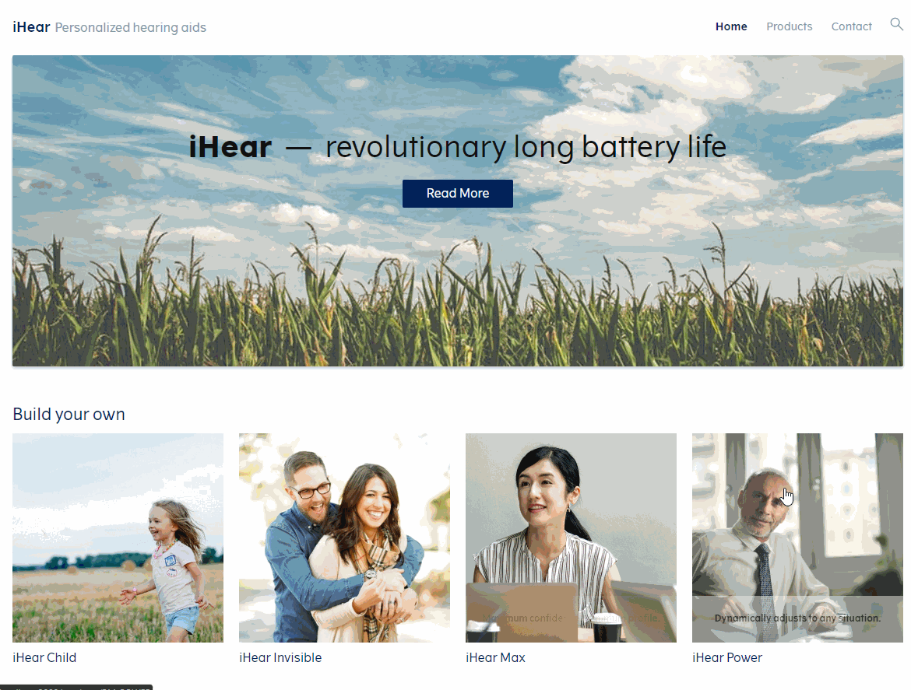

# iHear demo

Demo configurator that illustrates how to build a webshop-style configurator with the iHear model hosted on the CLM Platform.

The demo we are building looks like this:



## Getting started

Before you run the demo, change the settings in the `.env` file to match your local setup of the CLM Platform.

- Change the `REACT_APP_API_URL` to the URL of your running configurator service
- Change the `REACT_APP_PACKAGE_PATH` to reference the package you want to use. The demo can use any valid and published VT package containing a configurable product called iHear.

For example:

```
REACT_APP_API_URL=http://localhost:9010/configurator/v1
REACT_APP_PACKAGE_PATH=samples/ihear
```


Then install the code dependencies:

```
npm install
```

And start the application with

```
npm start
```
